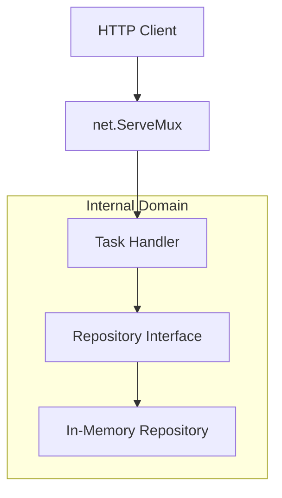

<div align="center">
  <h1>Go Task API</h1>
  <p>A minimalist, high-performance REST API for task management built strictly with the Go standard library net/http package.</p>

  

  <br>

[](https://pkg.go.dev/github.com/ESousa97/go-task-api)
[](https://opensource.org/licenses/MIT)
[](https://github.com/ESousa97/go-task-api)

</div>

---

**Go Task API** is a foundational project that demonstrates the power and simplicity of the Go standard library. Focused on low latency and minimal resource consumption, the API manages the lifecycle of `Tasks` in a completely stateless manner at the application layer, utilizing thread-safe in-memory persistence.

## Highlights

### Clean Handler Architecture

A lean implementation without heavy middlewares, focused on pure JSON contracts:

```go
// Example of manual routing and JSON handling
func (h *Handler) list(w http.ResponseWriter, _ *http.Request) {
    tasks := h.repo.List()
    w.Header().Set("Content-Type", "application/json")
    json.NewEncoder(w).Encode(tasks)
}
```

### Available Endpoints

| Method | Endpoint | Description       |
| ------ | -------- | ----------------- |
| `GET`  | `/tasks` | List all tasks    |
| `POST` | `/tasks` | Create a new task |

## Tech Stack

| Technology       | Role                                           |
| ---------------- | ---------------------------------------------- |
| **Go 1.22+**     | Main runtime using `net/http` standard package |
| **ServeMux**     | Efficient native routing                       |
| **RWMutex**      | Concurrency control for In-Memory Repository   |
| **JSON Encoder** | Data streaming via `io.Writer`                 |

## Prerequisites

- **Go >= 1.22**

## Installation and Usage

### Local Execution

```bash
git clone https://github.com/ESousa97/go-task-api.git
cd go-task-api
go run cmd/server/main.go
```

### Testing the API (curl)

**Create Task:**

```bash
curl -X POST -H "Content-Type: application/json" -d '{"title": "Implement API", "description": "Use net/http", "status": "doing"}' http://localhost:8080/tasks
```

**List Tasks:**

```bash
curl http://localhost:8080/tasks
```

## Architecture

The project follows simplified **Domain-Driven Design (DDD)** and **Dependency Inversion** principles.



## Roadmap

Follow the project's evolution stages:

- [x] **Phase 1: The Foundation** — Basic CRUD with `net/http` and In-Memory persistence.
- [ ] **Phase 2: Real Persistence** — PostgreSQL integration using Pure SQL.
- [ ] **Phase 3: The Brain** — Middleware implementation and `context` usage.
- [ ] **Phase 4: Professional Architecture** — Repository Pattern refinement and Clean Architecture.
- [ ] **Phase 5: Reliability and Deploy** — Containerization with Docker and Test suite.

## Contributing

Follow the suggested Bounded Contexts and extreme modularization as per project governance rules.

## License

This project is licensed under the **MIT License**.

<div align="center">

## Author

**Enoque Sousa**

[](https://www.linkedin.com/in/enoque-sousa-bb89aa168/)
[](https://github.com/ESousa97)
[](https://enoquesousa.vercel.app)

**[⬆ return to top](#go-task-api)**

Made with ❤️ by [Enoque Sousa](https://github.com/ESousa97)

**Project Status:** Active — Constantly updated

</div>
